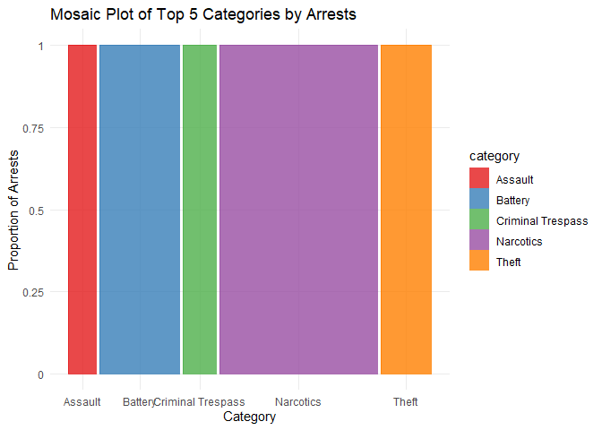

Grow Irish Project
================

## Grow Irish: Group Project

## Q1 : What are the top two categories in terms of number of arrests?

``` r
library(dplyr)
```

    ## 
    ## Attaching package: 'dplyr'

    ## The following objects are masked from 'package:stats':
    ## 
    ##     filter, lag

    ## The following objects are masked from 'package:base':
    ## 
    ##     intersect, setdiff, setequal, union

``` r
library(DBI)
library(dbplyr)
```

    ## 
    ## Attaching package: 'dbplyr'

    ## The following objects are masked from 'package:dplyr':
    ## 
    ##     ident, sql

``` r
library(odbc)

odbcListDrivers()
```

    ##                                                      name        attribute
    ## 1                                              SQL Server         APILevel
    ## 2                                              SQL Server ConnectFunctions
    ## 3                                              SQL Server        CPTimeout
    ## 4                                              SQL Server    DriverODBCVer
    ## 5                                              SQL Server        FileUsage
    ## 6                                              SQL Server         SQLLevel
    ## 7                                              SQL Server       UsageCount
    ## 8                                    PostgreSQL ANSI(x64)         APILevel
    ## 9                                    PostgreSQL ANSI(x64) ConnectFunctions
    ## 10                                   PostgreSQL ANSI(x64)    DriverODBCVer
    ## 11                                   PostgreSQL ANSI(x64)        FileUsage
    ## 12                                   PostgreSQL ANSI(x64)         SQLLevel
    ## 13                                   PostgreSQL ANSI(x64)       UsageCount
    ## 14                                PostgreSQL Unicode(x64)         APILevel
    ## 15                                PostgreSQL Unicode(x64) ConnectFunctions
    ## 16                                PostgreSQL Unicode(x64)    DriverODBCVer
    ## 17                                PostgreSQL Unicode(x64)        FileUsage
    ## 18                                PostgreSQL Unicode(x64)         SQLLevel
    ## 19                                PostgreSQL Unicode(x64)       UsageCount
    ## 20                          ODBC Driver 17 for SQL Server       UsageCount
    ## 21                          ODBC Driver 17 for SQL Server         APILevel
    ## 22                          ODBC Driver 17 for SQL Server ConnectFunctions
    ## 23                          ODBC Driver 17 for SQL Server        CPTimeout
    ## 24                          ODBC Driver 17 for SQL Server    DriverODBCVer
    ## 25                          ODBC Driver 17 for SQL Server        FileUsage
    ## 26                          ODBC Driver 17 for SQL Server         SQLLevel
    ## 27               Microsoft Access Driver (*.mdb, *.accdb)       UsageCount
    ## 28               Microsoft Access Driver (*.mdb, *.accdb)         APILevel
    ## 29               Microsoft Access Driver (*.mdb, *.accdb) ConnectFunctions
    ## 30               Microsoft Access Driver (*.mdb, *.accdb)    DriverODBCVer
    ## 31               Microsoft Access Driver (*.mdb, *.accdb)        FileUsage
    ## 32               Microsoft Access Driver (*.mdb, *.accdb)        FileExtns
    ## 33               Microsoft Access Driver (*.mdb, *.accdb)         SQLLevel
    ## 34 Microsoft Excel Driver (*.xls, *.xlsx, *.xlsm, *.xlsb)       UsageCount
    ## 35 Microsoft Excel Driver (*.xls, *.xlsx, *.xlsm, *.xlsb)         APILevel
    ## 36 Microsoft Excel Driver (*.xls, *.xlsx, *.xlsm, *.xlsb) ConnectFunctions
    ## 37 Microsoft Excel Driver (*.xls, *.xlsx, *.xlsm, *.xlsb)    DriverODBCVer
    ## 38 Microsoft Excel Driver (*.xls, *.xlsx, *.xlsm, *.xlsb)        FileUsage
    ## 39 Microsoft Excel Driver (*.xls, *.xlsx, *.xlsm, *.xlsb)        FileExtns
    ## 40 Microsoft Excel Driver (*.xls, *.xlsx, *.xlsm, *.xlsb)         SQLLevel
    ## 41            Microsoft Access Text Driver (*.txt, *.csv)       UsageCount
    ## 42            Microsoft Access Text Driver (*.txt, *.csv)         APILevel
    ## 43            Microsoft Access Text Driver (*.txt, *.csv) ConnectFunctions
    ## 44            Microsoft Access Text Driver (*.txt, *.csv)    DriverODBCVer
    ## 45            Microsoft Access Text Driver (*.txt, *.csv)        FileUsage
    ## 46            Microsoft Access Text Driver (*.txt, *.csv)        FileExtns
    ## 47            Microsoft Access Text Driver (*.txt, *.csv)         SQLLevel
    ##                   value
    ## 1                     2
    ## 2                   YYY
    ## 3                    60
    ## 4                 03.50
    ## 5                     0
    ## 6                     1
    ## 7                     1
    ## 8                     1
    ## 9                   YYN
    ## 10                03.51
    ## 11                    0
    ## 12                    1
    ## 13                    1
    ## 14                    1
    ## 15                  YYN
    ## 16                03.51
    ## 17                    0
    ## 18                    1
    ## 19                    1
    ## 20                    1
    ## 21                    2
    ## 22                  YYY
    ## 23                   60
    ## 24                03.80
    ## 25                    0
    ## 26                    1
    ## 27                    3
    ## 28                    1
    ## 29                  YYN
    ## 30                02.50
    ## 31                    2
    ## 32        *.mdb,*.accdb
    ## 33                    0
    ## 34                    3
    ## 35                    1
    ## 36                  YYN
    ## 37                02.50
    ## 38                    2
    ## 39 *.xls,*.xlsx, *.xlsb
    ## 40                    0
    ## 41                    3
    ## 42                    1
    ## 43                  YYN
    ## 44                02.50
    ## 45                    2
    ## 46         *.txt, *.csv
    ## 47                    0

``` r
con <- DBI::dbConnect(odbc(),
                      Driver = "SQL Server",
                      Server = "mcobsql.business.nd.edu",
                      UID = "MSBAstudent",
                      PWD = "SQL%database!Mendoza",
                      Port = 3306, 
                      Database = "ChicagoCrime")

dbListFields(con, "IUCR")
```

    ## [1] "IUCR"        "category"    "subcategory" "index"

``` r
dbListFields(con, "crimes")
```

    ##  [1] "id"           "date"         "block"        "IUCR"         "locationType"
    ##  [6] "arrest"       "domestic"     "beat"         "district"     "ward"        
    ## [11] "area"         "latitude"     "longitude"

``` r
# SQL to join `IUCR` and `crimes` tables, then group by category, filter where arrests are TRUE, 
# and finally order the result by count of arrests in descending order
sql_statement <- "
  SELECT I.category, COUNT(*) AS 'Count'
  FROM crimes AS C
  JOIN IUCR I
  ON I.IUCR = C.IUCR 
  WHERE C.arrest = 'TRUE'
  GROUP BY I.category
  ORDER BY count DESC
"

# Send the query
select_q <- dbSendQuery(conn = con, statement = sql_statement)

# Fetch the result
select_res <- dbFetch(select_q)

# This result should have the category with the highest arrests
print(select_res)
```

    ##                             category  Count
    ## 1                          Narcotics 171474
    ## 2                            Battery  86435
    ## 3                              Theft  54882
    ## 4                  Criminal Trespass  36444
    ## 5                            Assault  30148
    ## 6                      Other Offense  29323
    ## 7                  Weapons Violation  24943
    ## 8                    Criminal Damage  15024
    ## 9             Public Peace Violation  11901
    ## 10                Deceptive Practice  11618
    ## 11                      Prostitution   9701
    ## 12  Interference With Public Officer   9553
    ## 13                           Robbery   7959
    ## 14               Motor Vehicle Theft   6522
    ## 15                          Burglary   6275
    ## 16        Offense Involving Children   2879
    ## 17                          Gambling   2711
    ## 18              Liquor Law Violation   2552
    ## 19                       Sex Offense   1697
    ## 20                          Homicide   1582
    ## 21               Crim Sexual Assault   1304
    ## 22 Concealed Carry License Violation    499
    ## 23                             Arson    322
    ## 24                         Obscenity    279
    ## 25                          Stalking    218
    ## 26                      Intimidation    149
    ## 27                        Kidnapping    133
    ## 28                  Public Indecency     89
    ## 29          Other Narcotic Violation     32
    ## 30                      Non-Criminal     20
    ## 31                 Human Trafficking      6
    ## 32                      Sex Offenses      6

``` r
head(select_res, 2)
```

    ##    category  Count
    ## 1 Narcotics 171474
    ## 2   Battery  86435

## Q2: Visual representation of the top 5 categories in terms of number of arrests

``` r
sql_statement <- "
  SELECT I.category, COUNT(*) AS 'Count'
  FROM crimes AS C
  JOIN IUCR I
  ON I.IUCR = C.IUCR 
  WHERE C.arrest = 'TRUE'
  GROUP BY I.category
  ORDER BY count DESC
"

select_q <- dbSendQuery(conn = con, statement = sql_statement)
```

    ## Warning in new_result(connection@ptr, statement, immediate): Cancelling
    ## previous query

``` r
select_res <- dbFetch(select_q)
print(select_res)
```

    ##                             category  Count
    ## 1                          Narcotics 171474
    ## 2                            Battery  86435
    ## 3                              Theft  54882
    ## 4                  Criminal Trespass  36444
    ## 5                            Assault  30148
    ## 6                      Other Offense  29323
    ## 7                  Weapons Violation  24943
    ## 8                    Criminal Damage  15024
    ## 9             Public Peace Violation  11901
    ## 10                Deceptive Practice  11618
    ## 11                      Prostitution   9701
    ## 12  Interference With Public Officer   9553
    ## 13                           Robbery   7959
    ## 14               Motor Vehicle Theft   6522
    ## 15                          Burglary   6275
    ## 16        Offense Involving Children   2879
    ## 17                          Gambling   2711
    ## 18              Liquor Law Violation   2552
    ## 19                       Sex Offense   1697
    ## 20                          Homicide   1582
    ## 21               Crim Sexual Assault   1304
    ## 22 Concealed Carry License Violation    499
    ## 23                             Arson    322
    ## 24                         Obscenity    279
    ## 25                          Stalking    218
    ## 26                      Intimidation    149
    ## 27                        Kidnapping    133
    ## 28                  Public Indecency     89
    ## 29          Other Narcotic Violation     32
    ## 30                      Non-Criminal     20
    ## 31                 Human Trafficking      6
    ## 32                      Sex Offenses      6

``` r
head(select_res, 5)
```

    ##            category  Count
    ## 1         Narcotics 171474
    ## 2           Battery  86435
    ## 3             Theft  54882
    ## 4 Criminal Trespass  36444
    ## 5           Assault  30148

``` r
library(ggmosaic)
```

    ## Loading required package: ggplot2

``` r
library(ggplot2)

# Using the top 5 data
top5_data <- head(select_res, 5)

ggplot(data=top5_data) +
  geom_mosaic(aes(weight=Count, x=product(category), fill=category)) +
  labs(title = "Mosaic Plot of Top 5 Categories by Arrests", 
       x = "Category", 
       y = "Proportion of Arrests") +
  scale_fill_brewer(palette="Set1") +  
  theme_minimal()
```

<!-- -->
